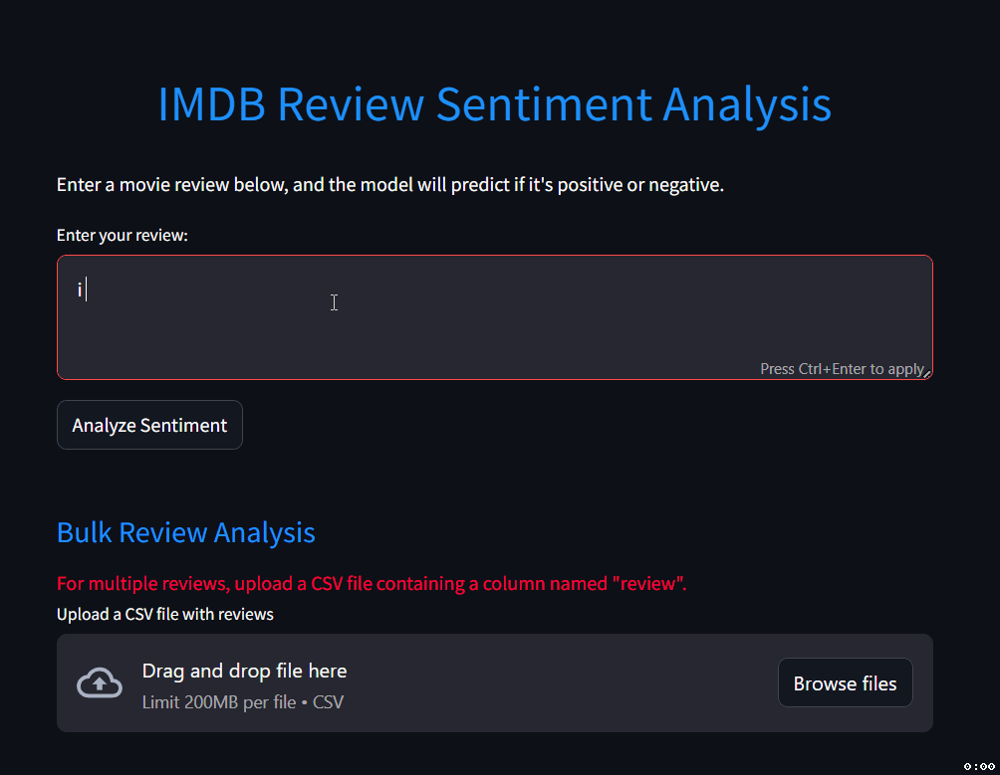

# IMDB Reviews Sentiment Analysis

## 📌 Overview
This project implements a **Sentiment Analysis** system for **IMDB movie reviews** using **Natural Language Processing (NLP)** and **Machine Learning**. The model classifies movie reviews as either **Positive** or **Negative** based on textual content.
With a web app so you can test it on one or multiple reviews . 
The project includes:

- **Data Preprocessing** using NLTK
- **TF-IDF Vectorization** for feature extraction
- **Logistic Regression Model** for classification
- **A Web Interface** built with **Streamlit** for interactive user experience
- **Batch Prediction** for analyzing multiple reviews from a CSV file

## 🚀 Features
- **Single Review Analysis:** Users can input a movie review and get instant sentiment prediction.
- **Bulk Review Processing:** Users can upload a CSV file containing multiple reviews, and the system will classify each review and provide a downloadable report.
- **Sentiment Distribution Visualization:** A bar chart displaying the sentiment distribution of bulk reviews.
- **Dark Mode UI:** A sleek, modern interface with a dark theme for a better user experience.

---

## 📂 Repository Structure
```
📁 imdb-reviews-sentiment-analysis
│── app.py                  # Streamlit web application
│── train.py                 # Script to train the sentiment analysis model
│── IMDB Dataset.csv         # Dataset containing movie reviews
│── sentiment_model.pkl      # Saved Logistic Regression model
│── tfidf_vectorizer.pkl     # Saved TF-IDF vectorizer
│── README.md               # Project documentation (this file)
│── requirements.txt        # python requirements for this project
```

---

## 🔧 Setup and Installation

### 1️⃣ Clone the Repository
```bash
git clone https://github.com/Aymen-Falleh/imdb-reviews-sentiment-analysis.git
cd imdb-reviews-sentiment-analysis
```

### 2️⃣ Create a Virtual Environment (Optional but Recommended)
```bash
python -m venv venv
source venv/bin/activate  # On macOS/Linux
venv\Scripts\activate     # On Windows
```

### 3️⃣ Install Dependencies
```bash
pip install -r requirements.txt
```

### 4️⃣ Run the Web Application
```bash
streamlit run app.py
```

---

## 📊 Model Training

The model is trained using the **IMDB Dataset** and **Logistic Regression**.

### 🔹 Steps in `train.py`:
1. **Load Data:** Reads `IMDB Dataset.csv`
2. **Preprocessing:** Cleans text (removes HTML tags, non-alphanumeric characters, and stopwords)
3. **TF-IDF Vectorization:** Converts text into numerical representation
4. **Train-Test Split:** Splits data (70% training, 30% testing)
5. **Train Logistic Regression Model:** Fits a model to predict sentiment
6. **Evaluate Performance:** Outputs accuracy and classification report
7. **Save Model & Vectorizer:** Stores trained model and vectorizer using `joblib`

### 🔹 Running Training Script:
```bash
python train.py
```
> This will generate `sentiment_model.pkl` and `tfidf_vectorizer.pkl`.

---

## 🌍 Web Application (`app.py`)
The Streamlit-based web app provides an interactive interface for users.

### 🔹 Features:
✅ **Single Review Sentiment Analysis** – Enter a review and get instant sentiment classification
✅ **Bulk Review Processing** – Upload a CSV file containing reviews for batch processing
✅ **Downloadable Results** – Export labeled reviews and sentiment distribution plots
✅ **Dark Mode UI** – Modern, visually appealing interface

### 🔹 Running the Web App:
```bash
streamlit run app.py
```

---

## 📜 Requirements
To run this project, install the following dependencies:
```bash
pip install pandas numpy nltk scikit-learn streamlit joblib matplotlib
```
Alternatively, use the `requirements.txt` file and install everything with:
```bash
pip install -r requirements.txt
```
> Ensure that **NLTK stopwords** are downloaded using `nltk.download('stopwords')`.

---

## 🛠 Technologies Used
- **Python** – Programming language
- **NLTK** – Natural Language Processing (for text preprocessing)
- **Scikit-Learn** – Machine Learning (for training Logistic Regression model)
- **Streamlit** – Web application framework
- **Matplotlib** – Visualization library
- **Joblib** – Model persistence

---
## Demo



## 📧 Contact
For any questions or issues, feel free to reach out:
- **Email:** [eymen.falleh2004@gmail.com](mailto:eymen.falleh2004@gmail.com)
- **GitHub:** [Aymen-Falleh](https://github.com/Aymen-Falleh)

---

## 📜 License
This project is licensed under the **MIT License** – feel free to use and modify it!

---


